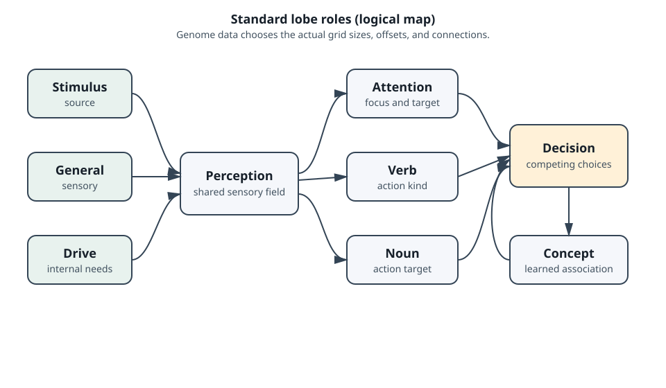
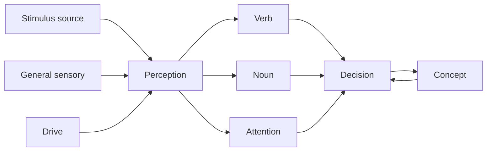

# Brains: lobes, neurons, and learning

The Creatures brain is a small, genome-built network. It is not a fixed neural
network shared by every creature. A genome supplies lobe records and connection
rules; the runtime allocates the grids, neurons, connections, and active-neuron
lists for that creature.

The core types are in [`src/c1/brain`](../src/c1/brain), especially
[`Brain`](../src/c1/brain/brain.hpp) and [`Lobe`](../src/c1/brain/lobe.hpp).

## The nine standard roles

The standard lobe names provide a useful map of the brain. Their exact sizes,
offsets, and connections are genome-defined.

| Role | Job in the model |
| --- | --- |
| Perception | Receives copies of signals from other input lobes and presents a common sensory field. |
| Drive | Represents internal needs and goal directions. |
| Stimulus source | Provides stimulus-related input patterns. |
| Verb | Represents the kind of action being considered. |
| Noun | Represents the object or thing an action concerns. |
| General sensory | Carries broader sensory information. |
| Decision | Selects competing action patterns. |
| Attention | Keeps target and focus information available to action selection. |
| Concept | Provides a learned or abstract association layer. |

The diagram is a logical reading aid. It is not a claim about fixed physical
coordinates; a genome can change the grid offset and dimensions.

## A lobe is a grid of neurons

Each lobe records a grid offset, width, height, activation threshold, baseline,
input gain, relaxation selector, an expression, winner-take-all flags, and two
connection rules. Its neurons carry grid coordinates, firing strength,
activation, source-lobe information, and temporary winner exclusion.

A connection points to a target neuron. It has a current weight, a target
weight, a baseline weight, and a dendrite state. The connection rule says which
lobe to target, how many connections to create, how far targets may spread,
which weight ranges to use, and how the weights change over time.

This makes learning a property of the network data. The runtime does not need
to know that a connection means “food” or “fear”; the genome's topology and
expressions give it that meaning.

## Early and late phases

Brain updates have an early phase and a late phase. Early work evaluates lobe
inputs and connection activity. Late work applies the lobe expression and
weight or dendrite changes that depend on the results. Perception-copying lobes
feed a consecutive range in the perception lobe, and mutually exclusive copies
retain their source-lobe ordinal so the original competition can be rebuilt.

Expressions are short token programs. They can stop on zero, add or subtract
with saturation, multiply in fixed-point form, or increment and decrement with
limits. They are data attached to a lobe or connection rule, not C++ code
generated for a particular creature.

Winner-take-all flags and neuron exclusion let a lobe choose a small set of
active winners. The decision lobe can therefore turn many partially active
signals into a candidate action. The creature action selector still applies
game rules afterward: target requirements, attention validity, sleep state, and
other eligibility checks are outside the neuron calculation.

## Drives, stimuli, and direct intervention

Drive levels are copied into brain inputs. Perception and attention add target
information. A stimulus carries chemical amounts, target neuron information,
and an optional target object or source creature. CAOS can also fire or trigger
brain inputs directly through its scripting interface. These paths converge on
the same brain state; they do not bypass the lobe update rules.

## Dreaming

An instinct can replay a short sequence of lobe and neuron choices during
sleep. Each dream step can add a selected chemical and run the brain's dream
operation. On completion, dream connection weights are normalised. This is why
the brain page belongs beside chemistry and life rather than under rendering:
dreaming changes persistent simulation state.

## Reading the implementation

- [`brain.hpp`](../src/c1/brain/brain.hpp) owns loading, updating,
  serialisation, firing, and dream-weight normalisation.
- [`lobe.hpp`](../src/c1/brain/lobe.hpp) defines lobe, neuron, connection, and
  perception-copy state.
- [`rules.hpp`](../src/c1/brain/rules.hpp) defines the expression tokens.
- [`instinct.hpp`](../src/c1/brain/instinct.hpp) describes dream steps.
