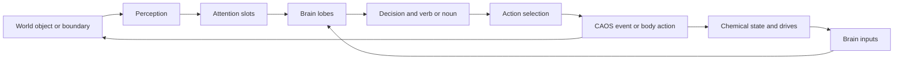
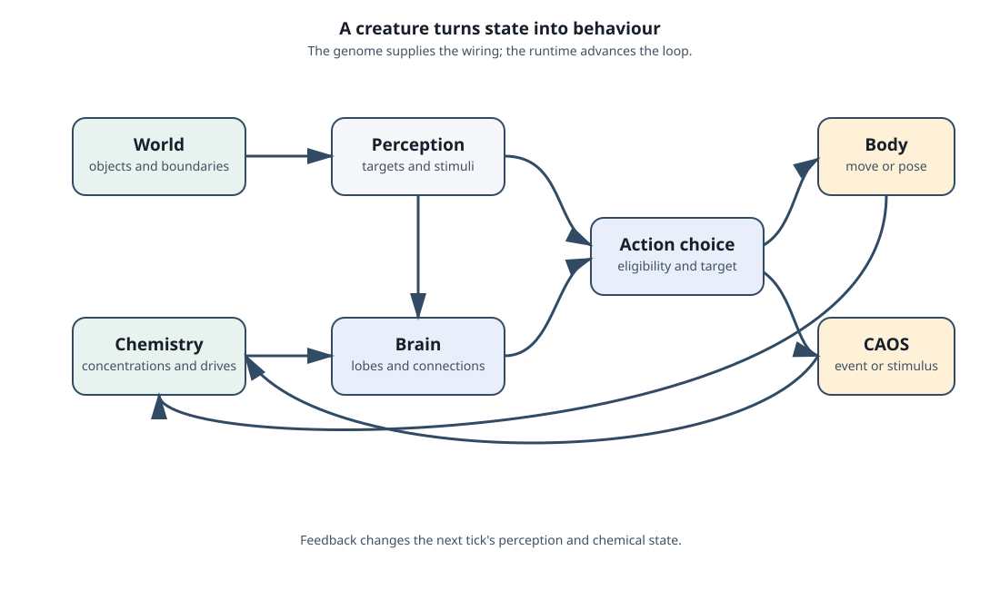

# Creatures: body, life, and behaviour

A creature is a world object with an animal inside it. The object identity
gives it a position, bounds, classifier, scripts, and rendering. The creature
state adds a genome, body and skeleton, brain, biochemistry, instincts, life
stage, and learned or runtime state.

The owning types are grouped in [`src/c1/creatures`](../src/c1/creatures),
with object identity supplied by [`Object`](../src/c1/objects/object.hpp).

## From a world change to an action

The game does not ask a creature for a single hard-coded answer. It moves
information through several stages.

Perception describes what is available. Attention gives a relevant target a
stable slot. The brain combines that information with drives and learned
connections. Action selection checks whether a candidate action needs a target,
whether the target is eligible, and whether the creature is asleep or otherwise
unable to act. The result may be movement, a gesture, a sound, a script event,
or a change in chemistry.

## The body is more than a sprite

The skeleton stores body parts and poses. Gait and pose data turn a selected
action into movement and animation. The object layer supplies world bounds and
rendering; the creature layer supplies the biological meaning of those bounds.
Motion links can report parent, child, shared-parent, and opposite-sex
relationships to perception and reproduction logic.

This separation is useful. A creature can remain the same animal while its
world object changes position, selected image, or render plane. Conversely, a
world object can receive a script event without being a creature at all.

## Life stages

The genome defines life-stage genes and the runtime tracks the current stage.
The recovered format has stages zero through seven, with stage seven terminal.
Stage changes select which genes are active and therefore which body, brain,
biochemistry, and instincts are present.

Age, incubation, conception, and stage timers advance from world ticks. The
tick rate is therefore part of game balance. A program that runs the loop many
times faster also runs those biological clocks faster unless it preserves the
native pacing.

## Reproduction and inheritance

Genomes are streams of tagged genes. Brain, biochemistry, and creature genes
are separate families. A gene records its subtype, sequence, load pass, stage
switch, and sex and mutation flags.

Offspring are made by recombining parental streams. The recombination process
can cross over, duplicate, omit, or mutate genes. The result is still a
structured genome: the next creature loads it by family, stage, and sex rather
than treating it as an opaque random blob.

The practical consequence is that inheritance can change a creature's neural
layout and chemical wiring as well as its appearance. A behavioural difference
may therefore begin in a genome record and only become visible much later as a
drive, attention choice, or action.

## Instinct and dreaming

Instincts are compact action or learning records. During sleep, the creature
can replay a dream step through selected brain lobes and neurons while adding a
dream chemical. When the dream completes, connection weights are normalised.
Dreaming is a real simulation phase; it is not only an animation shown by the
renderer.

## Words, learning, and voice

Speech is another world-facing path through the creature. A creature keeps
learned-word records with a recognised word, a response word, and a
reinforcement value. Hearing words can update that record, dispatch a built-in
stimulus, and queue a speech-range event for nearby objects. Speaking selects a
learned response, prepares it for the creature's voice data, and hands playback
and speech-bubble timing to runtime services.

The text policy and the audio presentation are separate. The creature owns
which word was learned and how reinforcement changes it. The host owns
multibyte text operations, voice-file access, and the visible or audible speech
event. This lets language remain part of the simulation without making the
brain or the renderer responsible for platform text and audio details.

## Where to look in the source

- [`Creature`](../src/c1/creatures/creature.hpp) owns the animal-facing state.
- [`Genome`](../src/c1/creatures/genome.hpp) defines gene streams and life
  stages.
- [`update.hpp`](../src/c1/creatures/update.hpp) groups the world-facing
  creature update operations.
- [`attention.hpp`](../src/c1/creatures/attention.hpp) maps targets into
  attention families and slots.
- [`stimulus.hpp`](../src/c1/creatures/stimulus.hpp) defines the packed stimulus
  context passed between perception, chemistry, and brain inputs.
- [`learned_words.hpp`](../src/c1/creatures/learned_words.hpp) and
  [`voice.hpp`](../src/c1/creatures/voice.hpp) define learned-word records and
  voice playback state.
