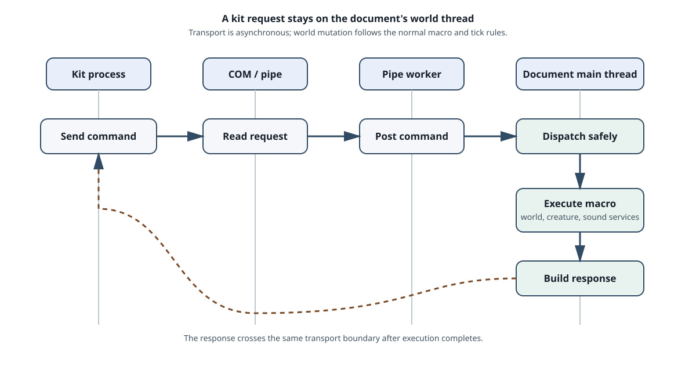

# CAOS and kits

CAOS is the game's event-driven scripting language. It is used by built-in
object scripts, creature actions, world tools, and external kits. A script is
not a second simulation loop: the macro scheduler runs it inside the document
update and gives it access to the current world context.

The interpreter and scheduler live in [`src/c1/scripting`](../src/c1/scripting),
with platform transport in [`src/c1/platform`](../src/c1/platform).

## How a CAOS script is selected

An object interaction produces a classifier and an event number. The script
registry looks up the matching family, genus, species, and event. A macro then
runs with a target object and a source object or creature where the event
provides them.

Scripts can create and destroy objects, move and animate them, send stimuli,
fire creature brain inputs, play sounds, change variables, call subroutines,
and queue further events. Some events are immediate; others are queued so the
current traversal can finish safely.

The important boundary is semantic: an object asks for “event 2 for this
classifier,” while the macro runtime decides how the source text is tokenised,
executed, and scheduled.

## Macro scheduling

The document runs scheduled macros after ordinary non-scenery object ticks and
before the creature cohort phase. A macro can therefore prepare a stimulus or
object change that the creature sees in that same world update. A macro that
destroys its target relies on the world runtime to remove all registry views;
it does not manually own the object's lifetime.

The vocabulary includes control flow, object motion and appearance, creature
operations, sound, speech and messages, stimuli and events, vehicles, debug
operations, and prefixes for application, agent, brain, DDE, system, and new
object operations. The command set is data-facing: scripts describe game
intent while the host supplies platform services.

## External kit communication

Kits use two related boundaries:

1. Windows automation exposes a COM `IDispatch` surface for kit calls.
2. The clean implementation also serves named-pipe requests and marshals their
   work to the main document thread.

The recovered pipe names are `\\.\pipe\SFC_OLE` for the shared automation
server and `\\.\pipe\Creatures1_Kit_ToolN` for a tool slot. A request is read
on the pipe worker, posted to the document host, executed with the normal macro
and world services, and returned as a terminated response. This keeps a kit
from mutating the world concurrently with the renderer or object registry.

Embedded kits have a registration record, a tool slot, a menu and toolbar
definition, and an automation connection. When a kit is removed, the macro
holder and the kit slot are released once; the running document remains the
owner of world state.

DDE support follows the same principle. The platform adapter translates the
Windows callback into semantic operations, and the scripting layer owns the
item and response meaning. A kit therefore sees a stable command surface even
though the transport is platform-specific.

## Reading the interface code

- [`macro.hpp`](../src/c1/scripting/macro.hpp) lists the macro host and command
  vocabulary.
- [`macro_holder.hpp`](../src/c1/scripting/macro_holder.hpp) owns scheduled
  macros.
- [`pipe_server.hpp`](../src/c1/scripting/pipe_server.hpp) defines the named
  pipe, main-thread dispatch, and COM proxy boundary.
- [`dde.hpp`](../src/c1/scripting/dde.hpp) defines the semantic DDE surface.
