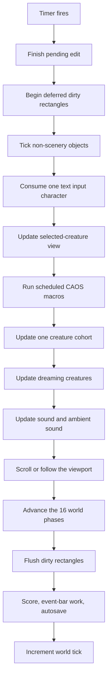
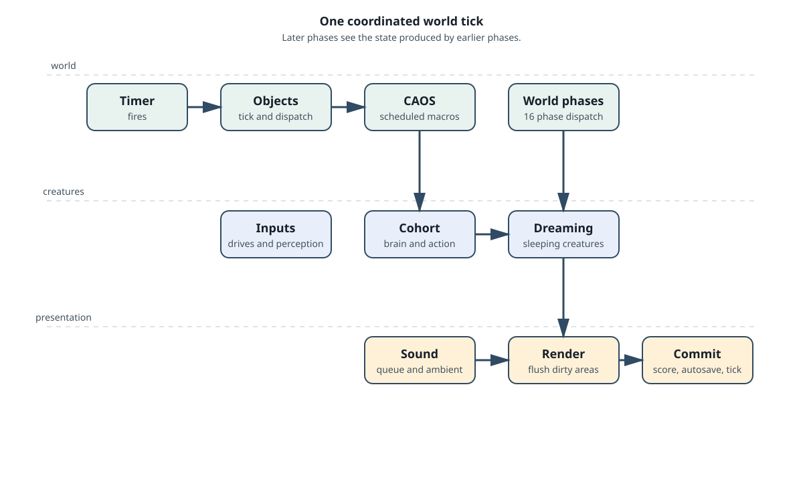

# The simulation loop

Creatures is a scheduled world, not a collection of independent animations.
The document owns the update timer and coordinates the systems that must see
the same world state. The default clean-engine interval is about 90 ms, close
to the observed native pace. A faster loop changes the rate at which age,
incubation, conception, timers, and other tick-based rules advance.

The coordinator is implemented by [`Document::update_world`](../src/c1/application/document.cpp).
The registries and top-level ownership live in
[`WorldRuntime`](../src/c1/world/runtime.hpp).

## One world update

The exact work is deliberately ordered. Later stages see the state produced by
earlier stages.

### Object work comes first

All non-scenery objects are ticked through the world registry. The registry is
read again as objects can be created or destroyed while a script runs. A
simple object may move, animate, wrap at a boundary, queue a pointer event, or
dispatch an interaction script. A compound object may advance several parts.

Scenery is map-owned visual content. It participates in rendering and save
files, but it does not enter the ordinary non-scenery tick registry.

### Creatures are updated in cohorts

Living creatures are split into five cohorts. A world tick updates one cohort's
brains and action choices, while biochemistry is updated for every creature in
that cohort. The cohort arrangement spreads expensive neural work across
successive ticks without changing the creature's persistent identity.

The creature phase has three useful ideas:

1. **Inputs** are refreshed from drives, motion, boundaries, and attended
   objects.
2. **Brain work** propagates lobe activity and lets the creature choose an
   eligible action.
3. **Chemistry** advances concentrations, reactions, receptors, and emitters.

Dreaming is processed after the active creature cohort. A sleeping creature
can therefore change its brain and chemistry without selecting an ordinary
awake action.

### Sound and the world clock

The sound manager is updated after creature work. Ambient sound is considered
when its cooldown expires and the world is not muted. The document then moves
through its 16 world phases, flushes deferred drawing damage, performs periodic
score and event-bar work, and may autosave. Only after this coordination does
the persistent world tick count increase.

Pausing is a coordinated state change. The document stops its timer, stops
continuous object sounds, and stops the mixer. Resuming arms the timer again;
it does not create a second independent simulation clock.

## Why the order matters

An object script can create a stimulus before the creature phase sees it. A
creature action can change an object before the renderer flushes its dirty
rectangle. A sound request can be queued during a script and serviced by the
sound phase. Saving after the world phases records one coherent tick boundary.

These relationships are more useful than memorising function names. When a
feature seems one tick late, first ask which phase owns it and which phase is
allowed to observe its result.
