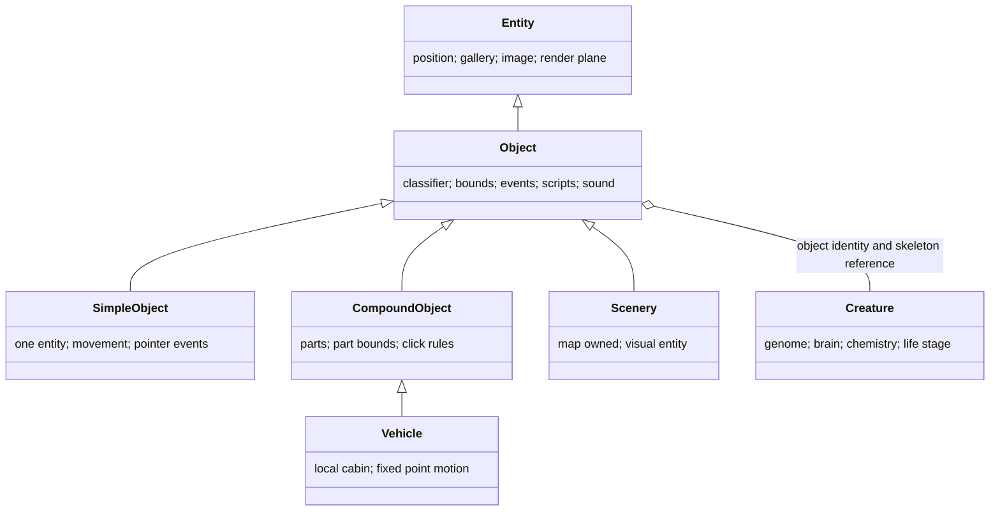
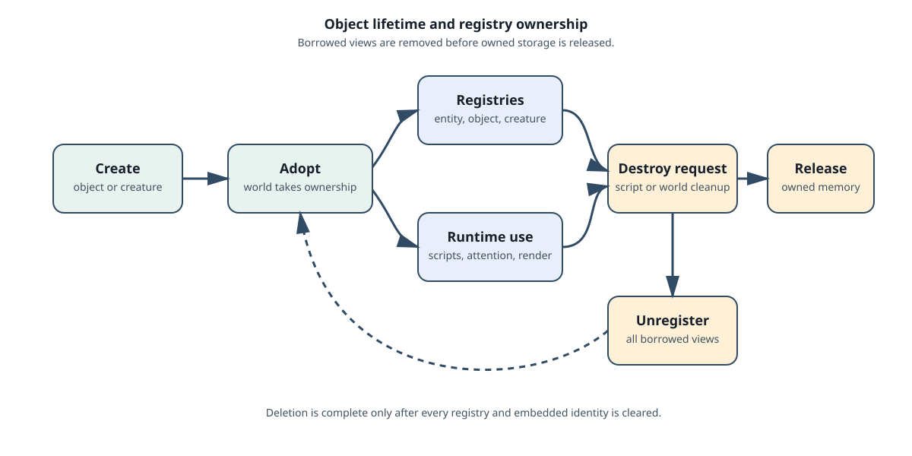

# The world and its objects

The world is a map plus a set of owned objects. It supplies rooms, ground,
ambient profiles, bacteria, object lifetime, script dispatch, and the spatial
rules used by creatures and vehicles.

The top-level owner is [`WorldRuntime`](../src/c1/world/runtime.hpp). Map data
is kept separately in [`MapData`](../src/c1/world/map.hpp).

## Map data

A new world starts with the original room layout and default ground heights.
The recovered map format has room capacity, a ground-height table, map-owned
bacterium records, an ambient-environment index, and a background gallery.
Room type selects the ambient temperature profile; a sentinel bottom value
represents a room without a normal floor boundary.

Rooms are spatial context. They do not own the creature's brain or the object
script that happens to be running in them. A creature can move between rooms
while retaining its identity and internal state.

## The object family

An entity knows how to select an image from a gallery and where it appears.
Object adds the game meaning: classifier, bounds mode, events, lifetime,
renderable membership, sound state, and script dispatch. Creature state is
owned separately and is linked to an object identity through its skeleton and
object-reference services. The world runtime keeps non-owning registries for
these identities and owns the top-level object and creature allocations.

The main object forms are:

- **Simple objects** have one entity. They move, animate, wrap, centre, and
  queue pointer or interaction events.
- **Compound objects** have up to ten parts, part bounds, and click or event
  configuration. Each part has its own local entity and offset.
- **Vehicles** extend compound objects with fixed-point motion, a local cabin,
  and arrival events for creatures in the cabin.
- **Scenery** is a map-owned visual object. It is saved with scenery and is not
  part of the ordinary non-scenery tick registry.

## Bounds, events, and classifiers

Objects can use default world bounds, one of two unbounded modes, vehicle-local
bounds, or an explicit rectangle. Bounds control movement, visibility, and
whether a queued event remains valid after a target moves.

Interaction events are selected by classifier and event number. CAOS scripts
use the family, genus, species, and event tuple to decide which behaviour runs.
The object does not need to know the script's text; it only dispatches the
semantic event through the macro system.

## Ownership and deletion

Creation goes through the world runtime's adoption path. Registration happens
before ownership transfer, so the object can be found by entity, object, and
creature views while it is alive. Destruction removes every borrowed registry
view, including a creature's embedded skeleton identity, before releasing the
owned object.

This rule prevents a stale renderable or attention target from surviving its
object. It also explains why deletion is a world operation even when a script
requested it.

## Spatial presentation

Renderable entities carry a render plane. The renderer performs a stable
ascending sort by plane, so equal-plane objects retain their insertion order.
Carried objects use a small native offset table to place their plane relative
to the carrier. Spatial state and visual order are related, but neither changes
the object's classifier or lifetime.

## Source map

- [`map.hpp`](../src/c1/world/map.hpp) defines rooms, ground, bacteria, and map
  environment data.
- [`entity.hpp`](../src/c1/objects/entity.hpp) defines image and spatial state.
- [`object.hpp`](../src/c1/objects/object.hpp) defines classifier, bounds, and
  object lifetime.
- [`simple_object.hpp`](../src/c1/objects/simple_object.hpp),
  [`compound_object.hpp`](../src/c1/objects/compound_object.hpp), and
  [`vehicle.hpp`](../src/c1/objects/vehicle.hpp) define the main object forms.
